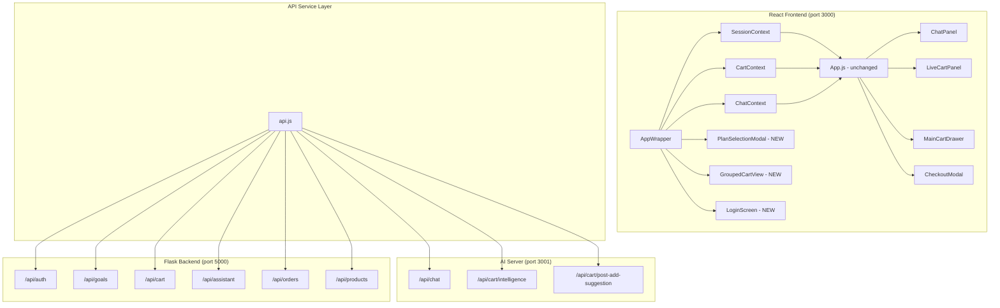
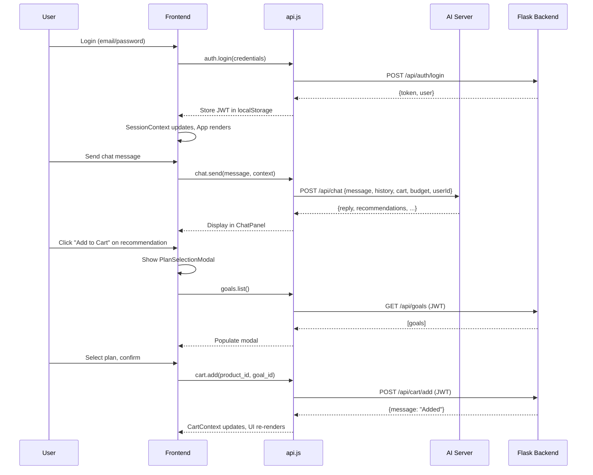

# Design Document: AI Assistant Integration

## Overview

This design integrates three existing systems — a React frontend, a Node.js AI Server, and a Flask Backend — into a cohesive shopping assistant experience. The integration is achieved exclusively through **new files** (contexts, services, and components) that wrap the existing component tree without modifying any pre-existing source code.

The core strategy is:

1. **API Service Layer** (`src/services/api.js`) — a single module centralizing all HTTP calls to both backends, handling JWT injection, timeouts, and error normalization.
2. **React Contexts** (`src/contexts/`) — `SessionContext` for auth state, `CartContext` for persisted goal-associated cart state, and `ChatContext` for chat history persistence.
3. **New UI Components** — `PlanSelectionModal` for goal assignment on add-to-cart, `GroupedCartView` for budget-tracked grouped cart within the existing drawer, and `LoginScreen` for authentication.
4. **App Wrapper** (`src/AppWrapper.js`) — a new entry point that wraps the existing `App` component with context providers, intercepting props to wire Flask backend data into existing components.



## Architecture

### System Architecture

The integration follows a **Backend for Frontend** pattern where the API service layer acts as a unified interface to both backends:

- **AI Server** (Node.js, port 3001): Handles conversational AI, intent extraction via Gemini, product recommendations, cart intelligence, and post-add suggestions. Stateless — no auth required, relies on `userId` in request body.
- **Flask Backend** (Python, port 5000): Handles authentication (JWT), goal/plan CRUD, persistent cart with goal associations, orders, and structured assistant flows (follow-up questions). Requires JWT Bearer token on all endpoints except `/api/auth`.
- **React Frontend** (port 3000): Single-page app, no router. Currently proxies to AI Server on port 3001. Integration adds Flask Backend communication via environment-configured base URL.

### Data Flow



### Key Design Decisions

| Decision | Rationale |
|----------|-----------|
| New `AppWrapper.js` as entry point | Wraps existing `App` with providers without modifying `App.js` |
| Single `api.js` module | Centralizes auth header injection, timeout handling, error normalization |
| React Context over Redux | Minimal dependencies, matches project simplicity (no existing state library) |
| localStorage for JWT + chat history | Matches existing pattern (proxy-based, no cookies), simple persistence |
| Environment variables for URLs | Allows different configs per environment without code changes |
| No router added | Constraint — continue single-page pattern, views switch via state |

## Components and Interfaces

### New Files Structure

```
client/src/
├── services/
│   └── api.js                  # Unified API service layer
├── contexts/
│   ├── SessionContext.js       # Auth state, user info, JWT management
│   ├── CartContext.js          # Persisted cart with goal associations
│   └── ChatContext.js          # Chat history persistence to localStorage
├── components/
│   ├── AppWrapper.js           # Context providers wrapper + view routing
│   ├── LoginScreen.js          # Login/Register form
│   ├── PlanSelectionModal.js   # Goal assignment modal on add-to-cart
│   └── GroupedCartView.js      # Budget-tracked grouped cart display
└── index.js                    # Modified entry: renders AppWrapper instead of App
```

### API Service Layer (`src/services/api.js`)

```javascript
// Environment configuration
const AI_SERVER_URL = process.env.REACT_APP_AI_SERVER_URL;       // e.g., "http://localhost:3001"
const FLASK_BACKEND_URL = process.env.REACT_APP_FLASK_BACKEND_URL; // e.g., "http://localhost:5000"

// Exported interface
export const api = {
  auth: {
    login(email, password): Promise<{token, user}>,
    register(name, email, password): Promise<{message}>,
  },
  chat: {
    send(message, history, cart, budget, urgency, userId, goals, orders): Promise<ChatResponse>,
  },
  assistant: {
    start(message): Promise<AssistantStartResponse>,
    answer(sessionId, answer): Promise<AssistantAnswerResponse>,
  },
  goals: {
    list(): Promise<Goal[]>,
    create(goalText, budget?): Promise<{message, goal}>,
    update(goalId, data): Promise<{message, goal}>,
    delete(goalId): Promise<{message}>,
    budget(goalId): Promise<GoalBudgetResponse>,
  },
  cart: {
    get(): Promise<{cart, suggestions}>,
    add(productId, goalId?): Promise<{message}>,
    remove(productId, goalId?): Promise<{message}>,
    grouped(): Promise<GroupedCartResponse[]>,
    intelligence(cart, userId, budget): Promise<CartIntelligenceResponse>,
    postAddSuggestion(productId, userId): Promise<PostAddSuggestionResponse>,
  },
  orders: {
    list(): Promise<Order[]>,
    checkout(): Promise<{message, order}>,
  },
  products: {
    list(): Promise<Product[]>,
  },
};
```

**Internal Mechanics:**
- `flaskFetch(path, options)` — prepends `FLASK_BACKEND_URL`, attaches JWT from localStorage, applies 30s timeout via AbortController
- `aiFetch(path, options)` — prepends `AI_SERVER_URL` (or uses relative path for proxy fallback), applies 30s timeout
- On 401 from Flask — clears JWT from localStorage, triggers `onAuthExpired` callback (consumed by SessionContext)
- If no JWT exists when calling Flask endpoints (except auth) — throws `AuthRequiredError` immediately

### SessionContext (`src/contexts/SessionContext.js`)

```javascript
// State shape
{
  user: { id, name, email } | null,
  token: string | null,
  isAuthenticated: boolean,
  isLoading: boolean,
}

// Provided actions
{
  login(email, password): Promise<void>,
  register(name, email, password): Promise<void>,
  logout(): void,
}
```

**Behavior:**
- On mount: checks localStorage for existing JWT, validates by decoding (not expired), sets user state
- On login success: stores token in localStorage, extracts userId from JWT payload, sets authenticated state
- On 401 intercepted by api.js: clears state, shows LoginScreen
- Provides `userId` derived from JWT for AI Server requests

### CartContext (`src/contexts/CartContext.js`)

```javascript
// State shape
{
  items: CartItem[],           // [{product_id, name, price, qty, category, goal_id}]
  goals: Goal[],              // [{id, goal_text, budget, created_at}]
  grouped: GroupedCartData[], // from /api/cart/grouped
  isLoading: boolean,
  intelligence: CartIntelligence | null,
}

// Provided actions
{
  addToCart(productId, goalId?): Promise<void>,
  removeFromCart(productId, goalId?): Promise<void>,
  refreshCart(): Promise<void>,
  refreshGoals(): Promise<void>,
  refreshGrouped(): Promise<void>,
  createGoal(goalText, budget?): Promise<Goal>,
}
```

**Behavior:**
- On auth change: fetches cart, goals, and grouped data from Flask Backend
- On add/remove: calls Flask Backend, then refreshes local state
- Triggers cart intelligence request (AI Server) within 500ms of cart change with debounce
- Exposes computed `cartTotal`, `itemCount`, budget status per goal

### ChatContext (`src/contexts/ChatContext.js`)

```javascript
// State shape
{
  messages: Message[],
  assistantSession: AssistantSession | null,
  isLoading: boolean,
}

// Provided actions
{
  sendMessage(text): Promise<void>,
  startAssistantFlow(message): Promise<void>,
  answerAssistantQuestion(answer): Promise<void>,
  clearHistory(): void,
}
```

**Behavior:**
- Persists messages to localStorage on every change (max 200 messages, FIFO eviction)
- On mount: restores from localStorage, gracefully handles corrupt data
- Includes current cart, goals, orders in AI Server context with each request
- Manages assistant session lifecycle (collecting → complete)

### PlanSelectionModal (`src/components/PlanSelectionModal.js`)

```javascript
// Props
{
  product: { product_id, name, price, category },
  onClose(): void,
  onSuccess(goalId?): void,
}
```

**Behavior:**
- Three radio options: "Add to Existing Plan", "Create New Plan", "General Cart"
- Fetches goals from CartContext on open
- "Create New Plan" shows inline form (name required, budget optional)
- Calls `api.cart.add()` on confirm, displays success/error inline
- Matches CheckoutModal's overlay/card pattern: `fixed inset-0 bg-black bg-opacity-50 z-50`, `bg-white rounded-2xl shadow-2xl`

### GroupedCartView (`src/components/GroupedCartView.js`)

```javascript
// Props
{
  grouped: GroupedCartData[],
  onRemoveItem(productId, goalId): void,
  onClose(): void,
}
```

**Behavior:**
- Renders inside MainCartDrawer as a tab/view toggle (drawer content switches between flat cart and grouped view)
- Each plan group shows: plan name, budget bar (green/yellow/red), spent/remaining
- General Cart section shows items without budget tracking
- Remove button calls CartContext.removeFromCart

### LoginScreen (`src/components/LoginScreen.js`)

```javascript
// Props
{
  onLoginSuccess(): void,
}
```

**Behavior:**
- Simple email/password form with login/register toggle
- Calls SessionContext.login or SessionContext.register
- Displayed when `isAuthenticated === false`
- Matches existing Tailwind aesthetic (orange-500 buttons, rounded-xl inputs, gray-50 bg)

### AppWrapper (`src/components/AppWrapper.js`)

```javascript
// Entry point component
// Wraps App with providers and handles view switching
```

**Behavior:**
- Provides SessionContext, CartContext, ChatContext
- If not authenticated: renders LoginScreen
- If authenticated: renders existing App component, injecting context-derived props
- Intercepts `onAddToCart` to show PlanSelectionModal before adding
- Manages the grouped cart view toggle within the drawer

## Data Models

### Frontend State Types

```typescript
// API Response Types
interface ChatResponse {
  reply: string;
  top_intents: { intent: string; confidence: number }[];
  budget: number | null;
  people_count: number | null;
  recommendations: Recommendation[];
  nudge: Nudge | null;
  urgency_required: boolean;
  eta: ETA | null;
  cart_total: number;
  remaining_budget: number | null;
  checkout_pending: boolean;
  budget_suggestions: BudgetSuggestion[];
  affinity_products: AffinityProduct[];
}

interface AssistantStartResponse {
  session_id: string;
  status: "collecting" | "complete";
  category: string;
  next_question: string | null;
  question_number: number;
  total_questions: number;
  budget: number | null;
}

interface AssistantAnswerResponse {
  session_id: string;
  status: "collecting" | "complete";
  next_question?: string;
  question_number?: number;
  total_questions?: number;
  // When complete:
  must_buy?: string[];
  optional?: string[];
  forget_list?: string[];
  recommended_products?: Product[];
  budget?: number;
  category?: string;
}

interface Goal {
  id: number;
  user_id: number;
  goal_text: string;
  budget: number | null;
  created_at: string;
}

interface CartItem {
  product_id: number;
  name: string;
  price: number;
  qty: number;
  category: string;
  goal_id: number | null;
}

interface GroupedCartData {
  goal_id: number | null;
  goal: string;
  budget: number;
  spent: number;
  remaining: number;
  budget_status: "green" | "yellow" | "red";
  budget_status_label: string;
  savings_suggestions: SavingsSuggestion[];
  products: Product[];
}

interface GoalBudgetResponse {
  goal_id: number;
  budget: number;
  spent: number;
  remaining: number;
  budget_status: "green" | "yellow" | "red";
  budget_status_label: string;
  savings_suggestions: SavingsSuggestion[];
}

interface Message {
  role: "user" | "assistant";
  content: string;
  recommendations: Recommendation[];
  intents: { intent: string; confidence: number }[];
  eta: ETA | null;
  urgency_required: boolean;
  budget_suggestions: BudgetSuggestion[];
  checkout_pending: boolean;
  // Assistant flow metadata
  assistant_question?: string;
  question_number?: number;
  total_questions?: number;
}

interface Recommendation {
  product_id: number;
  name: string;
  price: number;
  category: string;
  nudge_type: "bundle" | "compare" | "substitute" | "social_proof";
  avg_rating: number;
  stock: number;
  brand?: string;
}

interface Product {
  id: number;
  name: string;
  price: number;
  category: string;
  brand?: string;
  stock?: number;
  avg_rating?: number;
}

// localStorage keys
const STORAGE_KEYS = {
  JWT_TOKEN: "smartshop_jwt_token",
  CHAT_HISTORY: "smartshop_chat_history",
  USER_DATA: "smartshop_user_data",
};
```

### Backend Data Models (existing, for reference)

**Flask Backend — SQLAlchemy Models:**

| Model | Table | Key Fields |
|-------|-------|------------|
| User | users | id, name, email, password, total_orders |
| Goal | goals | id, user_id, goal_text, budget, created_at |
| Cart | carts | id, user_id |
| CartItem | cart_items | id, cart_id, goal_id (nullable), product_id, quantity |
| Product | products | id, name, price, category, brand, stock |
| Order | orders | id, order_code, user_id, intent, total_amount, order_status |

**AI Server — PostgreSQL (via `pg` pool):**

| Entity | Key Columns |
|--------|------------|
| products | product_id, name, price, category, stock, avg_rating |
| intents | intent_id, intent_name |
| intent_product_mapping | Maps intents to product recommendations |
| warehouses | warehouse_id, name, lat, lon |

