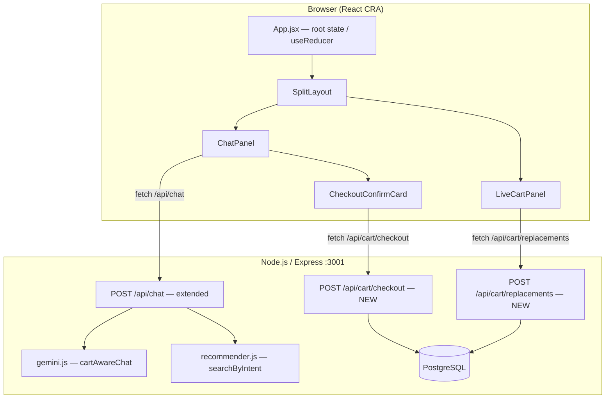
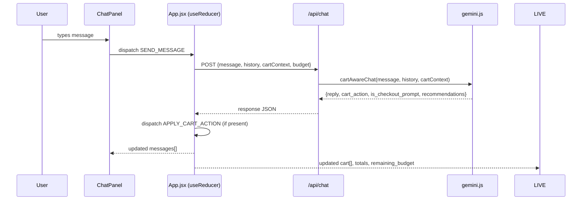
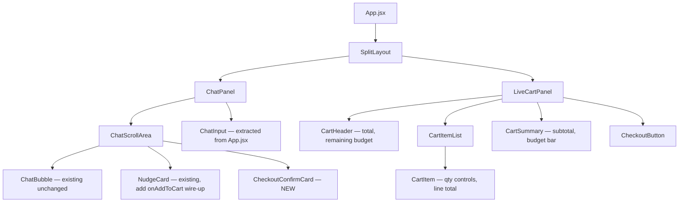

# Design Document: Conversational Cart Builder with Split-Screen Shopping Experience

## Overview

QuickCart AI currently renders a single-column chat widget (max-w-sm, 680px) where cart state lives
in `App.js` and is exposed via a slide-up `CartDrawer` overlay. This design replaces that layout
with a full-page split-screen experience: the left panel (55%) is the chat conversation and the
right panel (45%) is a live, always-visible cart that the AI actively manages throughout the
conversation.

The AI becomes a **cart agent** — it knows the cart contents, budget, and missing essentials at all
times and references them naturally. Budget-aware responses, smart cheaper-alternative suggestions,
and a conversational checkout flow (confirm → adjust → proceed → order) are all handled within the
chat. Cart state is managed in React (`useReducer`) and persisted to PostgreSQL only at checkout,
avoiding premature DB writes and aligning with the app's current ephemeral-session approach.

No new DB tables are required for v1. The existing `orders` and `order_items` tables handle final
persistence. A future `cart_sessions` / `cart_items` table design is noted but deferred.

---

## Architecture

### System Diagram



### Key Architectural Decisions

**Cart lives in React state, not DB during the session.** Persisting a half-built conversational
cart on every add/remove creates unnecessary write pressure and complicates session management (no
auth yet). The DB is written exactly once — at checkout confirmation — using the existing `orders`
and `order_items` tables.

**`cartAwareChat()` replaces `classifyIntent()` once a cart exists.** A new Gemini function in
`gemini.js` receives full cart context and returns a `cart_action` directive that the frontend
dispatches through `cartReducer` in the same render cycle, giving the illusion of instant AI-driven
cart management.

**`/api/chat` is extended, not replaced.** New `cartContext` field in the request body is optional,
so the existing single-column behaviour degrades gracefully.

### Data Flow



### Layout

```
Desktop (≥768px)
┌──────────────────────────────────────────────────────────────────────┐
│  QuickCart AI                                     [header full-width]│
├─────────────────────────────────┬────────────────────────────────────┤
│                                 │  Your Cart 🛒  (2 items)           │
│   [Chat messages scroll area]   │  ──────────────────────────────── │
│                                 │  Lays Chips ×2         ₹80        │
│   [NudgeCards inline]           │  Red Bull ×1           ₹150       │
│                                 │  ──────────────────────────────── │
│   [CheckoutConfirmCard]         │  Subtotal              ₹230       │
│                                 │  Budget ██████░░░  ₹230 / ₹500   │
│   [Input bar]                   │  [Checkout →]                     │
└─────────────────────────────────┴────────────────────────────────────┘
     55% width                         45% width

Mobile (<768px): single column, bottom tab switcher [💬 Chat] [🛒 Cart]
```

### New API Endpoints

| Method | Path | Purpose |
|--------|------|---------|
| POST | `/api/chat` | Extended — accepts `cartContext` in body |
| POST | `/api/cart/checkout` | Creates order in DB, returns order summary |
| POST | `/api/cart/replacements` | Finds cheaper alternatives for a given product |

---

## Components and Interfaces

### Component Tree



**Components retired (kept in repo, unmounted):** `CartDrawer.js`, `CartBadge.js`

### `SplitLayout.jsx`

```typescript
interface SplitLayoutProps {
  leftPanel: React.ReactNode;   // <ChatPanel />
  rightPanel: React.ReactNode;  // <LiveCartPanel />
}
// CSS: flex flex-col md:flex-row h-screen w-full
// Left:  w-full md:w-[55%] flex flex-col
// Right: w-full md:w-[45%] hidden md:flex flex-col border-l border-gray-200
// Mobile: activeTab state toggles visibility, bottom tab bar rendered
```

### `ChatPanel.jsx`

```typescript
interface ChatPanelProps {
  messages: Message[];
  loading: boolean;
  input: string;
  urgency: string | null;
  onInputChange: (val: string) => void;
  onSend: (override?: string) => void;
  onAddToCart: (item: RecommendationData) => void;
  onUrgencySelect: (val: string) => void;
  onCheckoutAction: (action: 'proceed' | 'cancel' | 'adjust') => void;
}
```

### `LiveCartPanel.jsx`

```typescript
interface LiveCartPanelProps {
  items: CartItem[];
  budget_limit: number | null;
  cart_total: number;           // derived, computed in App.jsx, passed down
  remaining_budget: number | null; // derived, computed in App.jsx, passed down
  checkout_state: 'idle' | 'confirming' | 'processing' | 'success' | 'error';
  onUpdateItem: (id: string, delta: number) => void;
  onRemoveItem: (id: string) => void;
  onSetBudget: (budget: number) => void;
  onCheckout: () => void;
}
```

### `CartItem.jsx`

```typescript
interface CartItemProps {
  item: CartItem;
  onUpdate: (id: string, delta: number) => void;
  onRemove: (id: string) => void;
}
// Renders: name, brand, price-per-unit, qty +/− controls, line total, trash icon
```

### `CartSummary.jsx`

```typescript
interface CartSummaryProps {
  cart_total: number;
  budget_limit: number | null;
  remaining_budget: number | null;
  item_count: number;
}
// Budget bar fill color logic:
//   remaining >= 0 && pct <= 80  → bg-orange-500
//   remaining >= 0 && pct >  80  → bg-amber-400
//   remaining < 0                → bg-red-500
```

### `CheckoutConfirmCard.jsx`

```typescript
interface CheckoutConfirmCardProps {
  cart_total: number;
  item_count: number;
  onProceed: () => void;
  onCancel: () => void;
  onAdjust: () => void;  // sends "let me adjust" back as a chat message
}
// Rendered as an inline assistant message bubble
// Visible only when checkout_state === 'confirming'
```

### `App.jsx` — State Shape

```typescript
interface AppState {
  chat: {
    messages: Message[];
    loading: boolean;
    urgency: '15min' | '30min' | '1hour' | 'later' | null;
  };
  cart: {
    items: CartItem[];
    budget_limit: number | null;
    checkout_state: 'idle' | 'confirming' | 'processing' | 'success' | 'error';
  };
}

interface CartItem {
  id: string;       // product_id
  name: string;
  price: number;
  qty: number;
  category: string;
  brand: string;
}

interface Message {
  role: 'user' | 'assistant';
  content: string;
  nudge: NudgeData | null;
  recommendations: RecommendationData[];
  intents: IntentScore[];
  eta: EtaData | null;
  urgency_required: boolean;
  cart_action: CartDirective | null;   // NEW
  is_checkout_prompt: boolean;          // NEW
}
```

### `cartReducer` — Action Types

```typescript
type CartReducerAction =
  | { type: 'ADD_ITEM';           item: CartItem }
  | { type: 'REMOVE_ITEM';        id: string }
  | { type: 'UPDATE_QTY';         id: string; delta: number }
  | { type: 'REPLACE_ITEM';       remove_id: string; add_item: CartItem }
  | { type: 'SET_BUDGET';         budget: number | null }
  | { type: 'CLEAR_CART' }
  | { type: 'SET_CHECKOUT_STATE'; state: CartSlice['checkout_state'] }

// ADD_ITEM:    id exists → qty++; else append
// REMOVE_ITEM: filter out
// UPDATE_QTY:  map → new qty; qty <= 0 → remove
// REPLACE_ITEM: REMOVE_ITEM(remove_id) then ADD_ITEM(add_item) in one dispatch
// CLEAR_CART:  items = []
```

---

## Data Models

### CartContext (sent from frontend to `/api/chat`)

```typescript
interface CartContext {
  items: Array<{
    id: string;
    name: string;
    price: number;
    qty: number;
    category: string;
  }>;
  cart_total: number;
  item_count: number;
  budget_limit: number | null;
  remaining_budget: number | null;
  covered_categories: string[];   // unique categories already in cart
}
```

### CartDirective (returned by `/api/chat` and `cartAwareChat()`)

```typescript
type CartDirective =
  | { type: 'ADD';    product_id: string; qty: number; product: CartProduct }
  | { type: 'REMOVE'; product_id: string }
  | { type: 'UPDATE'; product_id: string; qty: number }
  | { type: 'REPLACE'; remove_id: string; add_product: CartProduct }
  | { type: 'CLEAR' }

interface CartProduct {
  id: string;
  name: string;
  price: number;
  category: string;
  brand: string;
}
```

### Extended `/api/chat` Request

```typescript
interface ChatRequest {
  message: string;
  history: { role: string; content: string }[];
  cart?: CartContext;       // NEW — absent means no cart yet
  userLat?: number | null;
  userLon?: number | null;
  urgency?: string | null;
}
```

### Extended `/api/chat` Response

```typescript
interface ChatResponse {
  // Existing fields (unchanged):
  reply: string;
  top_intents: IntentScore[];
  budget: number | null;
  people_count: number;
  recommendations: RecommendationData[];
  nudge: NudgeData | null;
  urgency_required: boolean;
  eta: EtaData | null;
  // New fields:
  cart_action: CartDirective | null;
  is_checkout_prompt: boolean;
}
```

### `POST /api/cart/checkout` Request & Response

```typescript
// Request
interface CheckoutRequest {
  items: CartItem[];
  cart_total: number;
  user_id?: string;       // defaults to 'guest'
  userLat?: number;
  userLon?: number;
  intent?: string;        // top intent from last chat response
}

// Response 201
interface CheckoutResponse {
  order_id: string;       // 'ORD-{timestamp}-{random4}'
  total_amount: number;
  item_count: number;
  eta_minutes: number;
  warehouse_name: string;
  order_status: 'pending';
}
```

### `POST /api/cart/replacements` Request & Response

```typescript
// Request
interface ReplacementsRequest {
  product_id: string;
  max_price: number;
  category: string;
}

// Response 200
interface ReplacementsResponse {
  alternatives: Array<{
    product_id: string;
    name: string;
    price: number;
    brand: string;
    category: string;
    stock: number;
    savings_amount: number;
    savings_pct: number;
  }>;
}
```

### DB: No New Tables Required for v1

The existing `orders` and `order_items` tables (from `schema.sql`) fully support the checkout flow.
The order_id format `ORD-{timestamp}-{random4}` fits within the `VARCHAR(15)` `order_id` column.

```
Future v2 persistent cart tables (deferred):
  cart_sessions (session_id TEXT PK, user_id TEXT, created_at TIMESTAMPTZ, expires_at TIMESTAMPTZ)
  cart_items    (session_id TEXT FK, product_id VARCHAR(10) FK, qty INT, added_at TIMESTAMPTZ)
```

---

## Correctness Properties

Property 1: For every user message where `cartContext.items.length > 0`, the `cartAwareChat()` code
path is taken and `cart_action` in the response is either `null` or a directive with
`type ∈ {ADD, REMOVE, UPDATE, REPLACE, CLEAR}`.
**Validates: Requirements 2.1** (Cart memory — AI knows cart at all times)

Property 2: `cart_total` always equals `sum(item.price × item.qty)` for all items in the cart at
any point — after any cartReducer action, this invariant holds.
**Validates: Requirements 3.1** (Live cart total accuracy)

Property 3: `remaining_budget` equals `budget_limit - cart_total` when `budget_limit` is not null,
and is `null` when `budget_limit` is `null`.
**Validates: Requirements 3.1** (Budget awareness — remaining budget tracking)

Property 4: After dispatching `ADD_ITEM` for a new product id, `items.length` increases by exactly
1 and `items.find(i => i.id === newId).qty === 1`.
**Validates: Requirements 2.2** (Cart item addition)

Property 5: After dispatching `ADD_ITEM` for an already-present product id, `items.length` is
unchanged and the existing item's `qty` increases by exactly 1.
**Validates: Requirements 2.2** (Cart quantity increment for existing items)

Property 6: After dispatching `REPLACE_ITEM(remove_id, add_item)`, `items` contains no entry with
`id === remove_id` and contains exactly one entry with `id === add_item.id`.
**Validates: Requirements 4.1** (Smart replacements — cart updates immediately after approval)

Property 7: `CLEAR_CART` always produces `items = []` regardless of the prior cart state.
**Validates: Requirements 5.1** (Checkout flow — cart cleared after order creation)

Property 8: `SET_CHECKOUT_STATE('success')` is only ever dispatched after a 201 response from
`/api/cart/checkout`; `CLEAR_CART` is dispatched immediately after success, never before.
**Validates: Requirements 5.2** (Order creation sequence integrity)

Property 9: The checkout DB transaction is atomic — either both `orders` and `order_items` rows
are committed, or neither is (ROLLBACK on any error leaves DB unchanged).
**Validates: Requirements 6.1** (Final order creation — saves to orders + order_items tables)

Property 10: `findReplacements(productId, maxPrice, category)` returns only products satisfying
`price < maxPrice * 0.85 AND stock > 0 AND product_id != productId` for every result row.
**Validates: Requirements 4.1** (Smart replacements — cheaper alternatives only)

---

## Error Handling

### AI Unavailable

**Condition**: Gemini API call throws or times out.  
**Response**: Falls back to existing `localClassify()` + `localReply()`; `cart_action` is `null`.  
**Recovery**: Cart is never modified by a failed AI response; chat shows local fallback reply.

### Checkout DB Transaction Failure

**Condition**: `INSERT INTO orders` or `INSERT INTO order_items` fails (constraint violation,
connection loss, etc.).  
**Response**: Transaction is rolled back; endpoint returns `500 { error: "Checkout failed" }`;
`checkout_state` is set to `'error'`.  
**Recovery**: `CheckoutConfirmCard` shows a "Try again" button; cart items are preserved (not
cleared until a successful 201).

### Budget Exceeded During Chat

**Condition**: User adds an item that pushes `cart_total > budget_limit`.  
**Response**: AI warns proactively in the next reply ("You're ₹X over budget — want a cheaper
alternative?"); add is NOT blocked — the user always has final control.  
**Recovery**: User can remove items, accept a replacement, or raise/remove their budget.

### Out-of-Stock Item in Cart

**Condition**: A product in the cart has `stock = 0` at checkout time.  
**Response**: Checkout endpoint queries current stock; returns `422 { error: "Item X is out of stock",
product_id: "..." }`.  
**Recovery**: Frontend shows the error in chat; `checkout_state` resets to `'confirming'`; AI
suggests a replacement.

### Empty Cart Checkout Attempt

**Condition**: User clicks Checkout with zero items.  
**Response**: `CheckoutButton` is disabled when `items.length === 0`; if somehow called, endpoint
returns `422 { error: "Cart is empty" }`.  
**Recovery**: User is directed back to shopping.

### Network Error (fetch fails)

**Condition**: Both `/api/chat` and `/api/cart/checkout` fetch calls can throw on network failure.  
**Response**: Catch block appends an error message bubble to `chat.messages`; `loading` / `checkout_state`
reset appropriately.  
**Recovery**: User can retry by sending another message or clicking the retry button.

---

## Testing Strategy

### Unit Testing Approach

Test `cartReducer` exhaustively with all action types including edge cases (qty = 1 → remove on
decrement, replace non-existent id, clear empty cart). Test derived value calculations (`cart_total`,
`remaining_budget`, `covered_categories`). Use Jest (already available in CRA).

Key unit test cases:
- `ADD_ITEM` for new vs existing product
- `UPDATE_QTY` delta to 0 removes item
- `REPLACE_ITEM` atomicity
- `cart_total` after every action type
- `SET_BUDGET` null clears remaining_budget

### Property-Based Testing Approach

**Property Test Library**: fast-check (install: `npm install --save-dev fast-check`)

Properties to test:
- For any sequence of `ADD_ITEM`, `REMOVE_ITEM`, `UPDATE_QTY` actions,
  `cart_total === sum(items.map(i => i.price * i.qty))` always holds.
- For any cart state, `remaining_budget` is `null` iff `budget_limit` is `null`.
- For any `REPLACE_ITEM(removeId, addItem)`, the resulting state has no item with `removeId` and
  exactly one item with `addItem.id`.
- `findReplacements(productId, maxPrice, category)` always returns products where
  `price < maxPrice * 0.85` for all results.

### Integration Testing Approach

Test the `/api/cart/checkout` endpoint against a test PostgreSQL instance:
- Happy path: valid cart → 201 with correct `order_id`, `total_amount`, and DB rows written.
- Empty cart → 422.
- DB connection failure → 500 with rollback (no partial rows).

Test `/api/chat` with `cartContext`:
- Request with non-empty cart routes to `cartAwareChat()`.
- Response includes `cart_action` field (null or valid directive).
- Gemini fallback path returns `cart_action: null` (not an error).

### Manual QA Scenarios

1. Add items via chat → verify live cart updates instantly with no page refresh.
2. Say "too expensive" → verify replacement card appears → approve → cart swaps item.
3. Set budget → add items until over budget → verify red budget bar and AI warning.
4. Say "checkout" → verify `CheckoutConfirmCard` appears in chat.
5. Say "proceed" → verify order written to DB, cart clears, summary appears in chat.
6. Resize to mobile → verify tab switcher and cart panel toggle work correctly.
